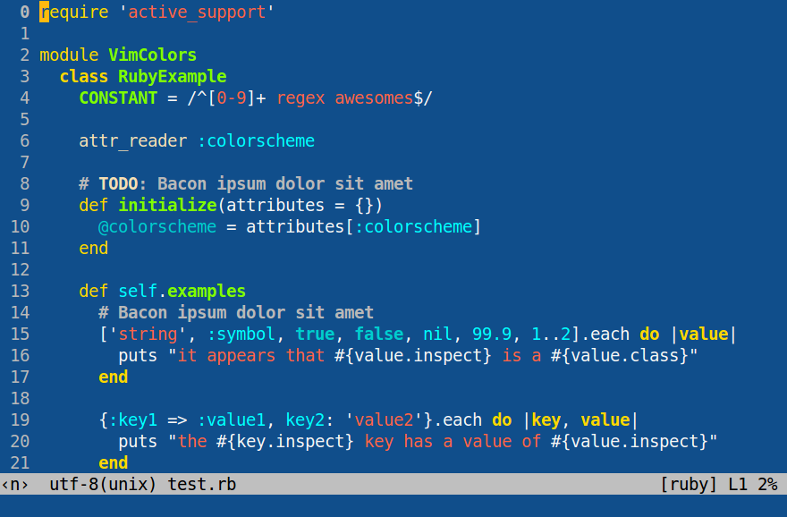

# Blue Mood for Gvim and terminal vim

This is a port of [emacs's Blue Mood theme](https://emacsthemes.com/themes/blue-mood-theme.html) for both Gvim and terminal vim.



Keep in mind that this port doesn't correspond 100% to the original emacs theme, due to the differences between vim's theming system and emacs's theming system.

## Compatibility notice

This colorscheme is more geared towards the gui, which means that terminal vim is supported only for vim versions 7.4.1799 and up, as from this version onwards, the option `set termguicolors` has been added, which allows for support of gui colors in terminals that have true color support. For more information on this topic, consult [this helpful section](https://github.com/mhinz/vim-galore#true-colors).

## Installation

### Manual

Place the theme file (`blue-mood.vim`) inside `~/.vim/colors` (Unix) or `vimfiles/colors` (Windows), creating the folder if it doesn't already exist.

### Package managers

Plugin Manager  | Add to your `/.vimrc`
--------------- | --------------------------------------------------
Vim Plug        | `Plug 'lmintmate/blue-mood-vim'`
dein.vim        | `call dein#add('lmintmate/blue-mood-vim')`
minpac          | `call minpac#add('lmintmate/blue-mood-vim')`
vim-packager    | `call packager#add('lmintmate/blue-mood-vim')`
plugpac         | `Pack 'lmintmate/blue-mood-vim'`
Vundle          | `Plugin 'lmintmate/blue-mood-vim'`
NeoBundle       | `NeoBundle 'lmintmate/blue-mood-vim'`

These instructions aren't tested, as I personally use the manual install, but should work.

## Activation

If you are on the gui, just set your colorscheme to `blue-mood` and you're good to go. If you are on the terminal, and provided that your version of vim is 7.4.1799 and above, first make sure your terminal emulator has true color support ([this gist](https://gist.github.com/XVilka/8346728) might be of help), and then put `set termguicolors` in your vimrc. Afterwards enable the colorscheme as normal.

### Credits

The initial structure for this file was largely based upon [ThemeCreator](https://github.com/mswift42/themecreator). I also consulted several articles of Vim documentation, most prominently the helpscreens `:he group-name`, `:he highlight-groups`, `:he cterm-colors` and the `:highlight` command, and also used [the checklist here](http://vimcasts.org/episodes/creating-colorschemes-for-vim/) to make sure I had styled all important elements.

## Lightline theme

With this colorscheme is also bundled a [Lightline](https://github.com/itchyny/lightline.vim) theme.


To use it, given you have installed Lightline with the plugin manager of your choice, put in your vimrc (note the underscore in the theme's name):
```vim
let g:lightline = {
    \ 'colorscheme': 'blue_mood',
    \ }
```
### Compatibility notice for this theme

If you installed the blue-mood vim colorscheme manually, you have to place the `autoload` folder somewhere where vim can see it. It might be thus easier to install the vim colorscheme via the plugin manager of your choice, which will automatically put the `autoload` folder in a place where it can be detected by vim.

This theme is also more geared towards the gui, and will display as intended on the terminal only if said terminal supports true colors and `set termguicolors` is present in the vimrc (see above). The theme can be used however even if both these conditions aren't met, as Lightline uses `lightline#colorscheme#fill` to convert the hex colors to their closest equivalent in the 256-color scale, though the colors won't be exactly the same as in the gui and true color terminal versions in this case.

Also note that other plugins that affect the statusline or the tabline (such as [vim-buftabs](https://github.com/b4b4r07/vim-buftabs), [vim-bufferline](https://github.com/bling/vim-bufferline), or [vim-modusline](https://github.com/sunaku/vim-modusline)) might interfere with the appearance of Lightline at launch (see [here](https://github.com/itchyny/lightline.vim/issues/150#issuecomment-187146798)).
